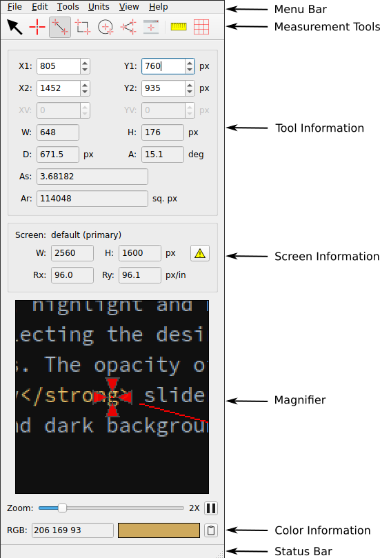

# MeazureTM

Meazure is a tool for easily measuring and capturing portions of the screen. Tasks such as measuring the size of a window,
capturing an image, determining the color of a pixel, and determining the screen size and resolution can all be
easily accomplished using Meazure.

This is the **Linux** version of Meazure. For the Windows version, go to [github.com/cthing/meazure](https://github.com/cthing/meazure).

## Linux Compatibility

This version of Meazure has been tested on Ubuntu 20.04 using the GNOME and KDE desktops. Meazure requires the X11
Window system and **is not supported on Wayland or Xwayland**.

## Downloading and Installation

The Debian package for Meazure can be [downloaded from GitHub](https://github.com/cthing/meazure-linux/releases).
As part of the installation, the file suffixes `.mea` and `.mpl` with the Meazure program.

## License

Refer to the [LICENSE](LICENSE) file for details on the licensing of the Meazure program.

## Building

Refer to [Building.md](Building.md) for information on how to build Meazure from source.

## Known Issues

- Meazure is not supported on Wayland

- Certain Window Managers (e.g. Gnome) have areas into which the crosshair can be dragged but cannot be dragged out.
  Typically, these are areas on the side, bottom or top edges of the screen where the Window Manager provides its
  icon bars and decoration. If a crosshair is dragged into one of these dead zones, use the text fields to move the
  crosshair out.

## Feedback

Please [open an issue on GitHub](https://github.com/cthing/meazure-linux/issues) for feature requests and to report
bugs.

## Financial Contributions

We hope Meazure is a valuable addition to your software toolbox. Please consider
making a [financial contribution](https://github.com/sponsors/baron1405). Thank you!

## Changelog

### Changes 4.0 (Windows) to 5.0 (Linux)

- First release of Meazure on Linux
- The thickness of the measurement tool lines can be adjusted
- The Ruler tool has been completely redesigned to provide a pair of orthogonal rulers that can be dragged, resized
  and rotated
- The screen grid spacing can now be set in any units supported by Meazure
- The screen grid size, origin offset, and angular orientation can now be set in addition to the grid spacing
- The zoom controls and color display on the main user interface have been reorganized for clarity
- The Tool and Ruler preference pages show sample lines, crosshairs and rulers on light and dark backgrounds
  to help when changing colors and opacities.
- The hard reset button has been moved from a dedicated preference page to a button on the preference dialog
- The popup data window and origin marker visibility controls have been moved from the Tools preference page to
  the View menu
- Profiles are now called configurations
- Sample profiles (configurations) are no longer included with Meazure
- The ability to specify a startup profile has been removed
